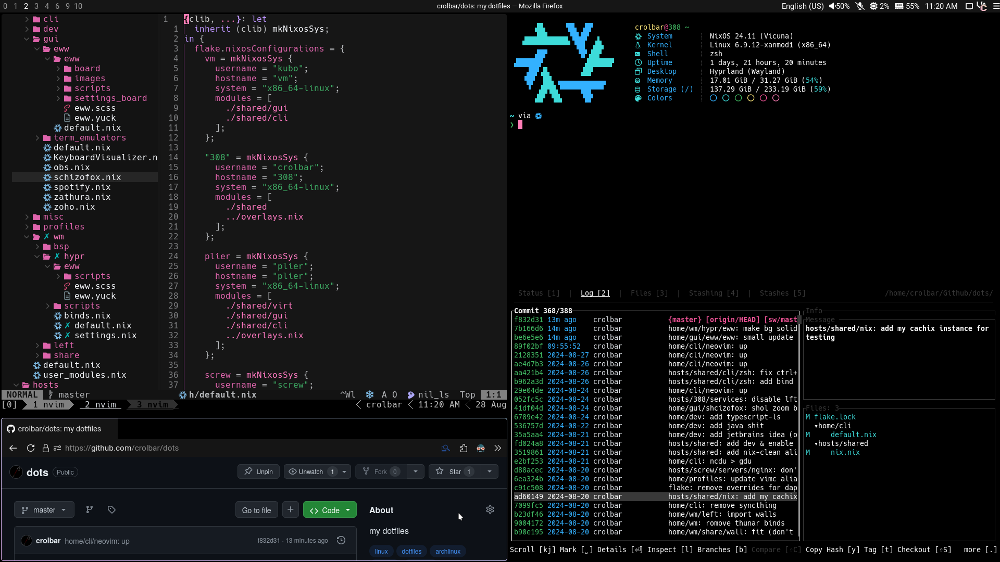
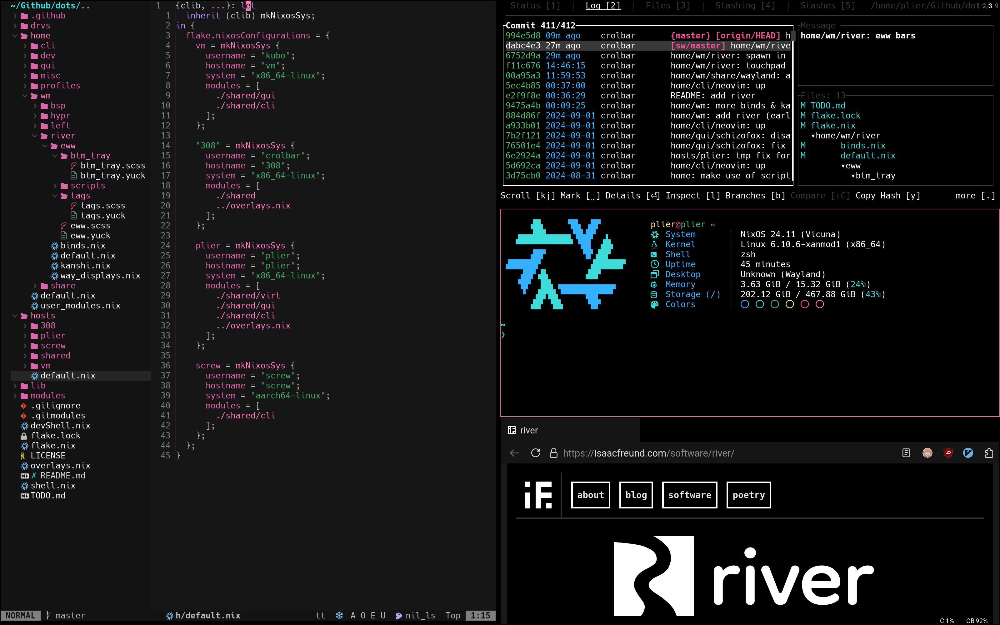

<h1 align="center"> NixOS - Home Manager - Flakes config </h1>

<div align="center">
    This <a href="https://nixos.wiki/wiki/Flakes ">nix flake</a> contains NixOS configurations for all of my <a href="#Hosts" />systems</a> and with the help of <a href="https://github.com/nix-community/home-manager">Home Manager</a> for all of the <a href="#Software" >software</a> that I'm using. 
</div><br/><br/>



<details><summary><b>river</summary>



</details>


<details>
    <summary><h1>Repository Tree</h1></summary>

```nix
.
├── checks
│   └── default.nix
├── derivations
│   ├── binsider.nix
│   ├── KeyboardVisualizer.nix
│   ├── rmpc.nix
│   └── zohoMail.nix
├── home
│   ├── cli
│   │   ├── zzz
│   │   │   ├── dapu.nix
│   │   │   └── default.nix
│   │   ├── btop.nix
│   │   ├── default.nix
│   │   ├── git.nix
│   │   ├── gitui.nix
│   │   ├── lazygit.nix
│   │   ├── leetcode_cli.nix
│   │   ├── starship.nix
│   │   ├── tmux.nix
│   │   ├── zellij.nix
│   │   └── zsh.nix
│   ├── dev
│   │   ├── c.nix
│   │   ├── default.nix
│   │   ├── go.nix
│   │   ├── java.nix
│   │   ├── js.nix
│   │   ├── lua.nix
│   │   ├── nix.nix
│   │   ├── php.nix
│   │   ├── python.nix
│   │   └── rust.nix
│   ├── editors
│   │   ├── emacs
│   │   │   ├── crol.el
│   │   │   ├── default.nix
│   │   │   ├── epkgs.nix
│   │   │   └── init.el
│   │   ├── neovim
│   │   │   ├── nvim
│   │   │   │   ├── lua
│   │   │   │   │   ├── lib
│   │   │   │   │   │   └── nivm_tree_git_open.lua
│   │   │   │   │   ├── plugins
│   │   │   │   │   │   ├── brrr.lua
│   │   │   │   │   │   ├── cmp.lua
│   │   │   │   │   │   ├── colorizer.lua
│   │   │   │   │   │   ├── comment.lua
│   │   │   │   │   │   ├── conform.lua
│   │   │   │   │   │   ├── discord.lua
│   │   │   │   │   │   ├── dressing.lua
│   │   │   │   │   │   ├── feline.lua
│   │   │   │   │   │   ├── gitsigns.lua
│   │   │   │   │   │   ├── harpoon.lua
│   │   │   │   │   │   ├── ibl.lua
│   │   │   │   │   │   ├── init.lua
│   │   │   │   │   │   ├── lsp.lua
│   │   │   │   │   │   ├── markdown_preview.lua
│   │   │   │   │   │   ├── noice.lua
│   │   │   │   │   │   ├── nvimtree.lua
│   │   │   │   │   │   ├── oil.lua
│   │   │   │   │   │   ├── telescope.lua
│   │   │   │   │   │   ├── term.lua
│   │   │   │   │   │   ├── theme.lua
│   │   │   │   │   │   ├── treesitter.lua
│   │   │   │   │   │   └── zen.lua
│   │   │   │   │   ├── binds.lua
│   │   │   │   │   ├── init_lazy.lua
│   │   │   │   │   └── set.lua
│   │   │   │   ├── init.lua
│   │   │   │   ├── lazy-lock.json
│   │   │   │   └── LICENSE
│   │   │   └── default.nix
│   │   └── default.nix
│   ├── gui
│   │   ├── eww
│   │   │   ├── eww
│   │   │   │   ├── board
│   │   │   │   │   ├── board.scss
│   │   │   │   │   ├── board.yuck
│   │   │   │   │   ├── player-info.scss
│   │   │   │   │   ├── player-info.yuck
│   │   │   │   │   ├── power_menu.scss
│   │   │   │   │   └── power_menu.yuck
│   │   │   │   ├── images
│   │   │   │   │   ├── alacritty.png
│   │   │   │   │   ├── discord.png
│   │   │   │   │   ├── gimp.png
│   │   │   │   │   ├── github.png
│   │   │   │   │   ├── gpt.png
│   │   │   │   │   ├── lutris.png
│   │   │   │   │   ├── mousepad.png
│   │   │   │   │   ├── nvim.png
│   │   │   │   │   ├── qute.png
│   │   │   │   │   ├── reddit.png
│   │   │   │   │   ├── schizofox.png
│   │   │   │   │   ├── spotify.png
│   │   │   │   │   ├── steam.png
│   │   │   │   │   ├── thunar.png
│   │   │   │   │   ├── twitch.png
│   │   │   │   │   ├── twitter.png
│   │   │   │   │   ├── vbox.png
│   │   │   │   │   ├── vscodium.png
│   │   │   │   │   ├── x.png
│   │   │   │   │   └── youtube.png
│   │   │   │   ├── settings_board
│   │   │   │   │   ├── set_board.scss
│   │   │   │   │   └── set_board.yuck
│   │   │   │   ├── eww.scss
│   │   │   │   └── eww.yuck
│   │   │   ├── scripts
│   │   │   │   ├── dcc.nix
│   │   │   │   ├── default.nix
│   │   │   │   ├── player.nix
│   │   │   │   ├── volume.nix
│   │   │   │   └── weather.c
│   │   │   └── default.nix
│   │   ├── term_emulators
│   │   │   ├── ghostty_shaders
│   │   │   │   ├── crt.glsl
│   │   │   │   └── snow.glsl
│   │   │   ├── alacritty.nix
│   │   │   ├── default.nix
│   │   │   ├── foot.nix
│   │   │   ├── ghostty.nix
│   │   │   └── wezterm.nix
│   │   ├── default.nix
│   │   ├── KeyboardVisualizer.nix
│   │   ├── nextcloud.nix
│   │   ├── obs.nix
│   │   ├── schizofox.nix
│   │   ├── spotify.nix
│   │   ├── zathura.nix
│   │   └── zoho.nix
│   ├── misc
│   │   ├── rmpc
│   │   │   ├── config.ron
│   │   │   ├── default.nix
│   │   │   └── theme.ron
│   │   ├── agenix.nix
│   │   ├── default.nix
│   │   ├── gtk.nix
│   │   ├── mangohud.nix
│   │   ├── mpd.nix
│   │   └── xdg.nix
│   ├── profiles
│   │   ├── crolbar
│   │   │   ├── default.nix
│   │   │   └── shell_aliases.nix
│   │   ├── kubo
│   │   │   ├── default.nix
│   │   │   └── shell_aliases.nix
│   │   ├── plier
│   │   │   ├── default.nix
│   │   │   └── shell_aliases.nix
│   │   ├── screw
│   │   │   ├── default.nix
│   │   │   └── shell_aliases.nix
│   │   └── home.nix
│   ├── wm
│   │   ├── bsp
│   │   │   ├── eww
│   │   │   │   ├── scripts
│   │   │   │   │   ├── bsp.nix
│   │   │   │   │   ├── default.nix
│   │   │   │   │   └── pulse.nix
│   │   │   │   ├── default.nix
│   │   │   │   ├── eww.scss
│   │   │   │   └── eww.yuck
│   │   │   ├── default.nix
│   │   │   ├── polybar.nix
│   │   │   └── sxhkd.nix
│   │   ├── hypr
│   │   │   ├── eww
│   │   │   │   ├── scripts
│   │   │   │   │   ├── default.nix
│   │   │   │   │   ├── hyprland.c
│   │   │   │   │   ├── hyprland.nix
│   │   │   │   │   ├── pulse.nix
│   │   │   │   │   ├── workspace_scroll.c
│   │   │   │   │   └── workspace_scroll.nix
│   │   │   │   ├── default.nix
│   │   │   │   ├── eww.scss
│   │   │   │   └── eww.yuck
│   │   │   ├── scripts
│   │   │   │   ├── default.nix
│   │   │   │   ├── dispatch.c
│   │   │   │   └── dispatch.nix
│   │   │   ├── binds.nix
│   │   │   ├── default.nix
│   │   │   └── settings.nix
│   │   ├── i3
│   │   │   ├── binds.nix
│   │   │   ├── default.nix
│   │   │   └── kb.nix
│   │   ├── left
│   │   │   ├── eww
│   │   │   │   ├── btm_tray
│   │   │   │   │   ├── btm_tray.scss
│   │   │   │   │   └── btm_tray.yuck
│   │   │   │   ├── tags
│   │   │   │   │   ├── tags.scss
│   │   │   │   │   └── tags.yuck
│   │   │   │   ├── eww.scss
│   │   │   │   └── eww.yuck
│   │   │   ├── binds.nix
│   │   │   ├── default.nix
│   │   │   ├── kb.nix
│   │   │   ├── settings.nix
│   │   │   └── workspace_scroll.nix
│   │   ├── river
│   │   │   ├── eww
│   │   │   │   ├── btm_tray
│   │   │   │   │   ├── btm_tray.scss
│   │   │   │   │   └── btm_tray.yuck
│   │   │   │   ├── scripts
│   │   │   │   │   ├── default.nix
│   │   │   │   │   ├── ristate.c
│   │   │   │   │   └── ristate.nix
│   │   │   │   ├── tags
│   │   │   │   │   ├── tags.scss
│   │   │   │   │   └── tags.yuck
│   │   │   │   ├── default.nix
│   │   │   │   ├── eww.scss
│   │   │   │   └── eww.yuck
│   │   │   ├── binds.nix
│   │   │   ├── default.nix
│   │   │   ├── kanshi.nix
│   │   │   ├── settings.nix
│   │   │   └── way_displays.nix
│   │   ├── share
│   │   │   ├── binds
│   │   │   │   ├── default.nix
│   │   │   │   └── river.nix
│   │   │   ├── rofi
│   │   │   │   ├── default.nix
│   │   │   │   └── spotlight-dark.rasi
│   │   │   ├── scripts
│   │   │   │   ├── default.nix
│   │   │   │   ├── default-sink.nix
│   │   │   │   ├── rgb.nix
│   │   │   │   ├── volSock.nix
│   │   │   │   └── volume.nix
│   │   │   ├── wall
│   │   │   │   ├── wallpapers
│   │   │   │   │   ├── wall0.png
│   │   │   │   │   ├── wall1.png
│   │   │   │   │   └── wall3.png
│   │   │   │   ├── default.nix
│   │   │   │   └── wall.nix
│   │   │   ├── wayland
│   │   │   │   ├── anyrun.nix
│   │   │   │   └── default.nix
│   │   │   ├── x11
│   │   │   │   └── default.nix
│   │   │   ├── dunst.nix
│   │   │   └── picom.nix
│   │   ├── sway
│   │   │   ├── binds.nix
│   │   │   ├── default.nix
│   │   │   └── settings.nix
│   │   └── xfwm
│   │       └── default.nix
│   ├── default.nix
│   └── user_modules.nix
├── hosts
│   ├── 308
│   │   ├── servers
│   │   │   ├── default.nix
│   │   │   └── syncthing.nix
│   │   ├── audio.nix
│   │   ├── boot.nix
│   │   ├── default.nix
│   │   ├── fs.nix
│   │   ├── hardware.nix
│   │   ├── net.nix
│   │   ├── programs.nix
│   │   ├── security.nix
│   │   ├── services.nix
│   │   └── user.nix
│   ├── plier
│   │   ├── servers
│   │   │   ├── default.nix
│   │   │   └── syncthing.nix
│   │   ├── audio.nix
│   │   ├── boot.nix
│   │   ├── default.nix
│   │   ├── fs.nix
│   │   ├── hardware.nix
│   │   ├── net.nix
│   │   ├── programs.nix
│   │   ├── security.nix
│   │   ├── services.nix
│   │   └── user.nix
│   ├── screw
│   │   ├── servers
│   │   │   ├── blocky.nix
│   │   │   ├── default.nix
│   │   │   ├── forge.nix
│   │   │   ├── freshrss.nix
│   │   │   ├── grafana.nix
│   │   │   ├── nfs.nix
│   │   │   ├── nginx.nix
│   │   │   └── prometheus.nix
│   │   ├── boot.nix
│   │   ├── default.nix
│   │   ├── fs.nix
│   │   ├── hardware.nix
│   │   ├── net.nix
│   │   ├── security.nix
│   │   ├── services.nix
│   │   └── user.nix
│   ├── shared
│   │   ├── cli
│   │   │   ├── default.nix
│   │   │   ├── yazi.nix
│   │   │   └── zsh.nix
│   │   ├── dev
│   │   │   └── default.nix
│   │   ├── gamer
│   │   │   ├── default.nix
│   │   │   └── steam.nix
│   │   ├── gui
│   │   │   ├── default.nix
│   │   │   ├── fonts.nix
│   │   │   ├── qt.nix
│   │   │   ├── thunar.nix
│   │   │   └── xdg.nix
│   │   ├── virt
│   │   │   └── default.nix
│   │   ├── agenix.nix
│   │   ├── default.nix
│   │   ├── env.nix
│   │   ├── locales.nix
│   │   └── nix.nix
│   ├── vm
│   │   ├── boot.nix
│   │   ├── default.nix
│   │   ├── fs.nix
│   │   ├── net.nix
│   │   ├── security.nix
│   │   ├── services.nix
│   │   └── user.nix
│   └── default.nix
├── lib
│   ├── bindsTranslator.nix
│   ├── default.nix
│   ├── sys_builders.nix
│   ├── utils.nix
│   └── writers.nix
├── modules
│   ├── hm
│   │   ├── cbinds.nix
│   │   └── default.nix
│   └── nixos
│       ├── default.nix
│       └── syncthing.nix
├── secrets
│   ├── freshRSSpass.age
│   ├── git.age
│   ├── leet.age
│   └── secrets.nix
├── templates
│   ├── rust-parts
│   │   ├── src
│   │   │   └── main.rs
│   │   ├── Cargo.lock
│   │   ├── Cargo.toml
│   │   └── flake.nix
│   └── default.nix
├── devShell.nix
├── flake.lock
├── flake.nix
├── LICENSE
├── overlays.nix
├── README.md
├── shell.nix
└── TODO.md

80 directories, 300 files

```

</details>

# Hosts

-   **308**: Desktop PC with a Ryzen 5 3600 and a 1060 3bg (old but does the job for me). Running Hyprland.
-   **plier**: ASUS Vivobook with an Intel i5-1235U (got it mainly for the OLED display). Running river.
-   **screw**: Raspbery Pi 4B as an home server (until I make a proper one). Running [blocky](https://github.com/0xERR0R/blocky) & a [forgejo](https://forgejo.org/) instance.
-   **vm**: Basic VM config for testing.

Don't even ask me about the names.. (I have an weird naming convention I know)

# Software

The software I use across my systems is:

### Wayland compositors

-   [Hyprland](https://github.com/hyprwm/Hyprland) - (config: [home/wm/hypr](home/wm/hypr))
-   [river](https://isaacfreund.com/software/river/) - (config: [home/wm/river](home/wm/river)) (status cilent - [ristate](https://github.com/crolbar/ristate))

### Window managers

-   [LeftWM](https://github.com/leftwm/leftwm) - for when something doesn't work on river (config: [home/wm/left](home/wm/left))
-   [bspwm](https://github.com/baskerville/bspwm) - for when something doesn't work on Hyprland (config: [home/wm/bsp](home/wm/bsp))

### Terminal

| Name                                             | Description                                                                                   | Configuration                                                                               |
| :----------------------------------------------- | :-------------------------------------------------------------------------------------------- | :------------------------------------------------------------------------------------------ |
| Zsh                                              | shell                                                                                         | [home/cil/zsh.nix](home/cli/zsh.nix) & [hosts/shared/cil/zsh.nix](hosts/shared/cli/zsh.nix) |
| [yazi](https://github.com/sxyazi/yazi)           | file manager                                                                                  | [hosts/shared/cli/yazi](hosts/shared/cli/yazi.nix)                                          |
| [Starship](https://github.com/starship/starship) | easy and useful prompt                                                                        | [home/cli/starship](home/cli/starship.nix)                                                  |
| [tmux](https://github.com/tmux/tmux)             | terminal multiplexer (maybe switching to [zellij](https://github.com/zellij-org/zellij) soon) | [home/cli/tmux](home/cli/tmux.nix)                                                          |
| [Gitui](https://github.com/extrawurst/gitui)     | git frontend                                                                                  | [home/cli/gitui](home/cli/gitui.nix)                                                        |
| [neovim](https://github.com/neovim/neovim)       | text editor                                                                                   | [home/cli/neovim](home/cli/neovim)                                                          |

### GUI

| Name                                                | Description                                   | Configuration                                                                                                                        |
| :-------------------------------------------------- | :-------------------------------------------- | :----------------------------------------------------------------------------------------------------------------------------------- |
| [Alacritty](https://github.com/alacritty/alacritty) | terminal emulator                             | [home/cli/alacritty](home/gui/term_emulators/alacritty.nix)                                                                          |
| [Schizofox](https://github.com/schizofox/schizofox) | easy way for a daly-drivable hardened firefox | [home/cli/schizofox](home/gui/schizofox.nix)                                                                                         |
| [Zathura](https://github.com/pwmt/zathura)          | simple document viewer with vim bindings      | [home/gui/zathura](home/gui/zathura.nix)                                                                                             |
| [eww](https://github.com/elkowar/eww)               | widget system used mainly for bars            | [home/gui/eww](home/gui/eww) & [home/wm/hypr/eww](home/wm/hypr/eww) & [home/wm/left/leftwm/right/eww](home/wm/left/leftwm/right/eww) |
| [rofi](https://github.com/davatorium/rofi)          | launcher for x11                              | [home/wm/share/rofi](home/wm/share/rofi)                                                                                             |
| [anyrun](https://github.com/anyrun-org/anyrun)      | launcher for wayland                          | [home/wm/share/wayland/anyrun.nix](home/wm/share/wayland/anyrun.nix)                                                                 |
| [swww](https://github.com/LGFae/swww)               | wallpaper solution for wayland                | [home/wm/share/wall](home/wm/share/wall)                                                                                             |
| [feh](https://github.com/derf/feh)                  | wallpaper solution for x11                    | [home/wm/share/wall](home/wm/share/wall)                                                                                             |

# Credits

**BIG** help in the making of this flake were [NotAShelf's](https://github.com/NotAShelf) [nyx](https://github.com/NotAShelf/nyx) and [fufexan's](https://github.com/fufexan) [dotfiles](https://github.com/fufexan/dotfiles).
